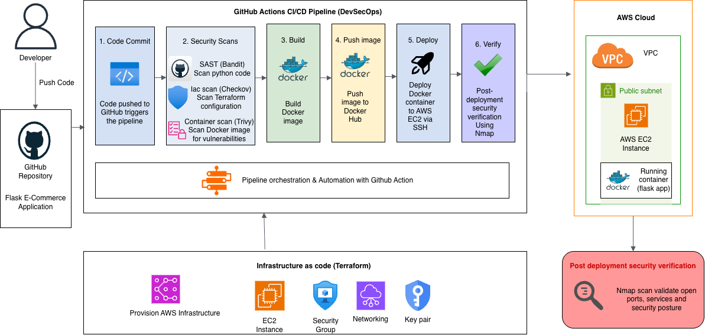

# DevSecOps Secure CI/CD Pipeline for Flask E-Commerce Application

## Project Overview
This project demonstrates a complete DevSecOps CI/CD pipeline for a Flask-based e-commerce web application. It integrates security practices into every stage of the software development lifecycle, from code commit to cloud deployment.

The application is containerized using Docker and automatically deployed to AWS EC2 via GitHub Actions. Security is enforced continuously using industry-standard scanning tools.

## Key Objectives
- Build a fully automated CI/CD pipeline using GitHub Actions.
- Integrate DevSecOps practices into every stage of development.
- Deploy a containerized Flask application on AWS EC2.
- Perform automated security scanning for code, containers, and infrastructure.
- Implement Infrastructure as Code using Terraform.

## Project Architecture

## Tech Stack

### Application
- Python
- Flask
- SQLite
- HTML
- Bootstrap

### DevOps Tools
- Git
- GitHub
- GitHub Actions
- Docker
- Docker Hub

### Security Tools
- Bandit (SAST)
- Trivy (Container Security Scanning)
- Checkov (Infrastructure as Code Security)
- Nmap (Network Security Scanning)

### Cloud & Infrastructure
- AWS EC2
- Terraform

## CI/CD Pipeline Workflow
1. Code Commit
Developers push code to the GitHub repository, triggering the pipeline.

2. Static Code Analysis (Bandit)
Scans Python code for:
- Hardcoded secrets
- Unsafe functions
- Common security vulnerabilities

3. Infrastructure Security Scan (Checkov)
Validates Terraform configuration for:
- Misconfigured resources
- Security best practices
- Cloud compliance issues

4. Container Security Scan (Trivy)
Analyzes Docker images for:
- OS vulnerabilities
- Dependency risks
- Known CVEs

5. Docker Build
Builds a secure, containerized version of the Flask application.

6. Docker Hub Push
Pushes the validated image to Docker Hub for deployment.

7. Automated Deployment
GitHub Actions deploys the container to an AWS EC2 instance via SSH.

8. Security Verification (Nmap)
Performs network scanning to verify:
- Open ports
- Exposed services
- Deployment security posture

## Application Features
- User registration and authentication
- Secure login system with password hashing
- Product listing page
- Shopping cart functionality
- Session management
- Dockerized deployment
- Fully automated CI/CD pipeline
- Infrastructure as Code using Terraform

## Security Implementation

### Bandit (SAST)
Detects insecure Python coding patterns and potential vulnerabilities early in development.

### Trivy
Performs deep scanning of Docker images for:
- Vulnerable packages
- OS-level security issues
- Dependency vulnerabilities

### Checkov
Ensures Terraform configurations follow security best practices for AWS infrastructure.

### Nmap
Used post-deployment to verify exposed services and validate network security posture.

## Infrastructure as Code (Terraform)
Provisioned resources include:
- AWS EC2 Instance
- Security Groups
- Networking Configuration

### Common Commands
terraform init
terraform validate
terraform plan
terraform apply

## Docker Workflow

### Build Image
docker build -t flask-app .

### Run Container
docker run -d -p 5001:5001 flask-app

### Push to Docker Hub
docker tag flask-app yojana20/flask-shop:latest
docker push yojana20/flask-shop:latest

## GitHub Actions Pipeline
On every push, the pipeline automatically:
1. Installs dependencies
2. Runs Bandit scan
3. Runs Checkov scan
4. Runs Trivy scan
5. Builds Docker image
6. Pushes image to Docker Hub
7. Deploys to AWS EC2
8. Executes post-deployment security validation

## Learning Outcomes
This project helped strengthen skills in:
- Full-stack Flask development
- Docker containerization
- CI/CD pipeline automation using GitHub Actions
- DevSecOps practices and secure SDLC
- AWS EC2 deployment and cloud networking
- Infrastructure as Code using Terraform
- Security scanning and vulnerability management

## Future Enhancements
- Implement HTTPS using Nginx reverse proxy
- Integrate AWS RDS for production-grade database
- Kubernetes-based deployment (EKS)
- SonarQube for advanced code quality analysis
- OWASP ZAP for dynamic security testing
- Monitoring with Prometheus and Grafana

## Author
Yojana Gangurde
DevSecOps | Cloud | Cybersecurity Enthusiast
GitHub: https://github.com/yojanagangurde-cloud-engineer/